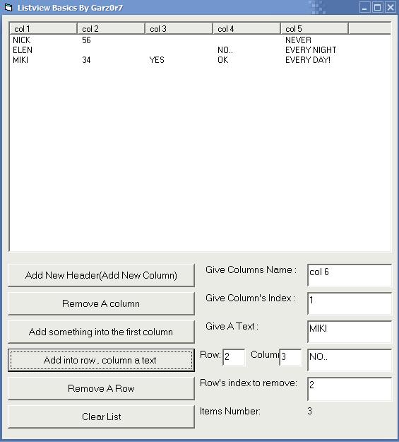



## ListView Basics

### Description

This will teach you how to deal with the ListView Control.VERY SIMPLE CODE.
 
### More Info
 

             |
---                |---
**Submitted On**   |2007-01-30 07:50:02
**By**             |[garz0r7](https://github.com/Planet-Source-Code/PSCIndex/blob/master/ByAuthor/garz0r7.md)
**Level**          |Beginner
**User Rating**    |4.3 (17 globes from 4 users)
**Compatibility**  |VB 6\.0
**Category**       |[Custom Controls/ Forms/  Menus](https://github.com/Planet-Source-Code/PSCIndex/blob/master/ByCategory/custom-controls-forms-menus__1-4.md)
**World**          |[Visual Basic](https://github.com/Planet-Source-Code/PSCIndex/blob/master/ByWorld/visual-basic.md)
**Archive File**   |[ListView\_B2045391302007\.zip](https://github.com/Planet-Source-Code/garz0r7-listview-basics__1-67758/archive/master.zip)

